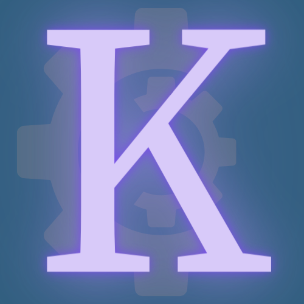

# Kolyteon

### A .NET class library for modelling common problems as generic binary CSPs (constraint satisfaction problems) and solving them using a choice of 32 different algorithms.

## Key features

- An abstract generic binary CSP class that:
  - models any instance of a specific problem type
  - is queryable by index with generally *O(1)* speed
  - generates problem size metrics and descriptive statistics
  - is extended for a specific problem type using the Template Method Pattern.
- Problem-specific binary CSP derivatives and complete class/type libraries for these puzzles:
  - Map Colouring
  - *N*-Queens
  - Shikaku
  - Sudoku.
- A generic binary CSP solver class that:
  - synchronously solves any binary CSP
  - is configurable at instantiation and runtime with any of 8 search strategies and 4 ordering strategies, for a total of 32 solving algorithms
  - returns a result containing the solution found (if one exists) and algorithm performance metrics.
- A *verbose* generic binary CSP solver class that:
  - asynchronously solves any binary CSP
  - issues a progress notification to the client after every algorithm step, with data about the state of the search
  - can be configured with any algorithm, like the synchronous solver
  - can be slowed down by setting a time delay between steps
- Interfaces for the generic binary CSP and the solvers, so that they can be injected as dependencies.

## Documentation

The documentation can be found at <https://mattsortsthings.github.io/kolyteon>.

## Background

This library originated as project work I undertook as part of my Postgraduate Diploma in Computer Science from Birkbeck, University of London. All coding work is my own, but the underlying algorithms are well-established in CSP literature.

## Thanks

Many thanks to Dr Panos Charalampopoulos, my project supervisor, for his support and advice.
