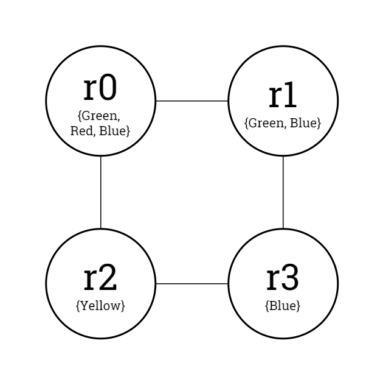
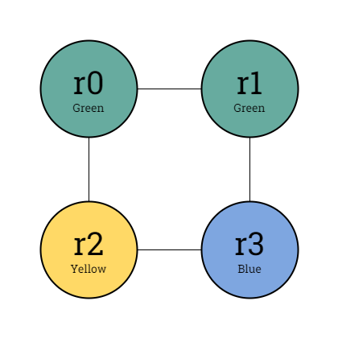
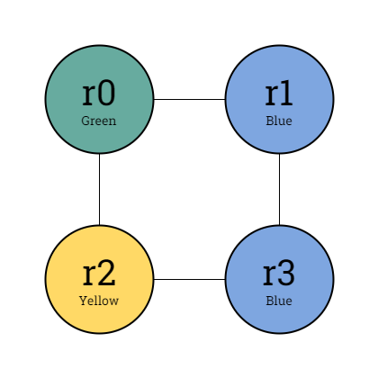
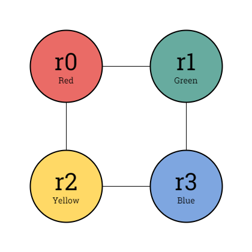
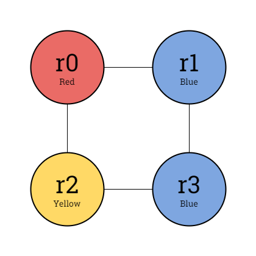
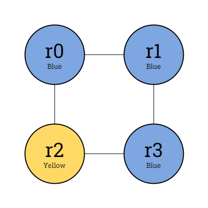
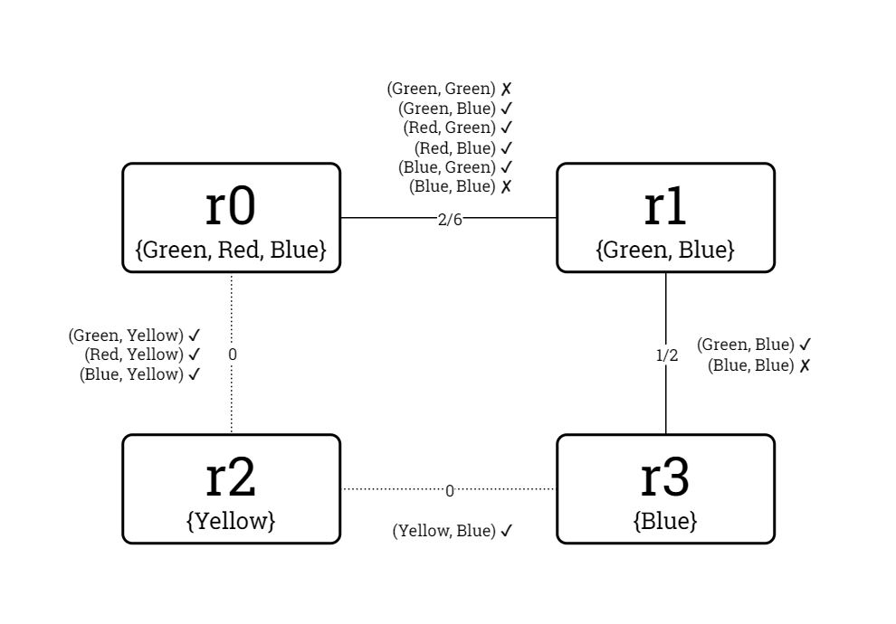
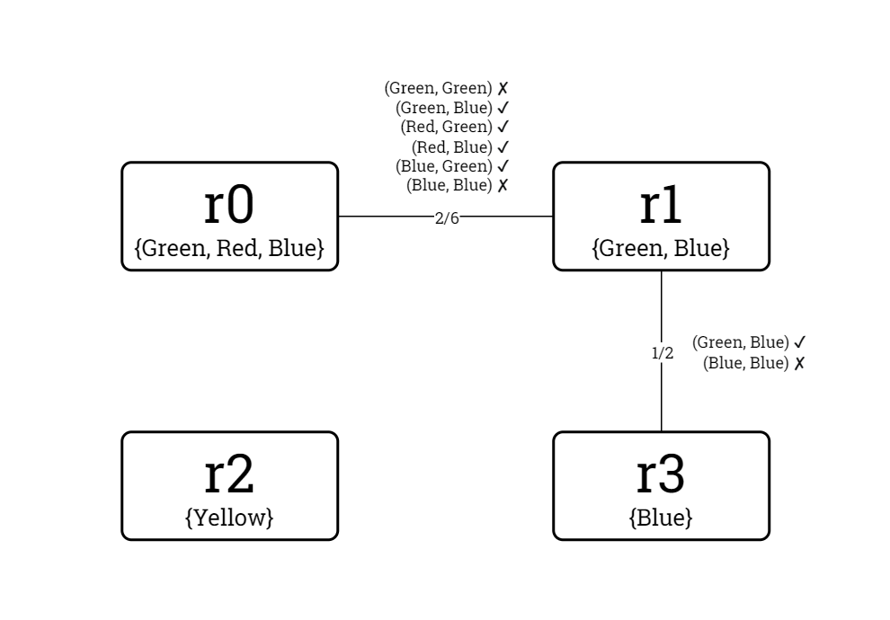

# Binary CSP Modelling

This document outlines the binary CSP modelling terminology to be used in the *Kolyteon* library.

- [Binary CSP Modelling](#binary-csp-modelling)
  - [Example Problem and Possible Solutions](#example-problem-and-possible-solutions)
  - [Binary CSP Definition](#binary-csp-definition)
  - [Key Terminology](#key-terminology)
  - [Constraint Graph](#constraint-graph)

## Example Problem and Possible Solutions

Consider the Graph Colouring problem below.

|  |
|:--------------------------------------------------------------------------------------------------:|
|                                  Example graph colouring problem.                                  |

To solve the problem, one must colour in each node with one of its permitted colours so that no two nodes connected by an edge are the same colour.

This problem has six possible solutions, comprised of every possible combination of colours. They are outlined in the table below.

|                                                              Possible Solution                                                              |  Valid?   |                     Faults                     |
|:-------------------------------------------------------------------------------------------------------------------------------------------:|:---------:|:----------------------------------------------:|
|  |  Invalid  |         (`r0`, `r1`) have same colour          |
|  |  Invalid  |         (`r1`, `r3`) have same colour          |
|  | **Valid** |                                                |
|  |  Invalid  |         (`r1`, `r3`) have same colour          |
|  | **Valid** |                                                |
|  |  Invalid  | (`r0`, `r1`) and (`r1`, `r3`) have same colour |

It can be seen that the problem has 2 valid solutions out of a possible 6.

We could attempt to solve a Graph Colouring problem of any size in this fashion, by iterating through every possible combination of assignments until either a valid solution is found or the combinations are exhausted. A more efficient approach is to model the problem as a binary CSP, which can be solved using a backtracking search algorithm.

## Binary CSP Definition

A binary constraint satisfaction problem (binary CSP) is a logical model of a problem. It is composed of:

- an ordered, finite, non-empty set of **variables**,
- an ordered set of **domains**, where:
  - each domain is an ordered, finite set of **domain values** that may be assigned to a particular variable,
- a finite set of **binary constraints**, where:
  - each binary constraint connects a different variable pair and the domain value pairs that may be assigned to them, restricting their permitted assignment pairs to a subset of the cartesian product of their domains.

The variable type and the domain value type must each have a context-independent natural ordering. For example, any collection of nodes should be ordered alphabetically by name.

We can model the Graph Colouring problem as a binary CSP as follows:

- The variables are the nodes.
  - Nodes are globally sorted alphabetically by name.
- Each node variable's domain is its set of permitted colours.
  - Colours are globally sorted `Green` (first), `Red`, `Yellow`, `Blue` (last).
- Every pair of node variables connected by an edge theoretically participates in a binary constraint.
  - The binary constraint has a predicate mandating that the two node variables must be assigned unequal colour values.

To solve a binary CSP, one must assign to every variable a value from its domain, so that all the binary constraints are satisfied.

A binary CSP may have 0, 1, or multiple solutions.

## Key Terminology

An **assignment** is the allocation of a domain value to a variable.

A **solution** is a set of 0 or more assignments.

A **full solution** is a set of assignments for every variable in the binary CSP.

A **partial solution** is a set of assignments for a subset of the variables (which may be an empty set).

Two variables are **adjacent** if they participate in a binary constraint.

A variable's **degree** is the number of binary constraints in which it participates, or in other words, the number of variables adjacent to the variable.

An assignment pair for a pair of adjacent variables is **inconsistent** when it is not permitted by the binary constraint in which they participate, otherwise it is **consistent**.

For two non-adjacent variables, therefore, every assignment pair is consistent.

A binary constraint's **tightness** is the probability of choosing an inconsistent assignment pair for its participating variables. This is calculated by taking the fraction *x*/*y*, where *x* is the total number of inconsistent assignment pairs and *y* is the size of the cartesian product of the domains.

A zero-tightness binary constraint imposes no restrictions on the assignment pairs for its participating variables and should therefore be disregarded.

A **theoretical binary constraint** is one that should exist for a variable pair given the rules of the problem type. For example, in a Graph Colouring problem, there is a theoretical binary constraint between every pair of connected graph nodes.

A **proven binary constraint** is a theoretical binary constraint that has been tested across the entire cartesian product of the participating variables' domains and found to have a non-zero tightness. In a Graph Colouring problem, a pair of connected graph nodes is only proven adjacent if there is at least one colour value present in both their domains.

During the process of modelling a problem as a binary CSP, the theoretical binary constraints are evaluated. Only proven binary constraints are added to the binary CSP.

The **constraint density** of a binary CSP is the probability that any two variables participate in a binary constraint. This is calculated by taking the fraction *x*/*y*, where *x* is the number of binary constraints and *y* is the maximum possible number of binary constraints given the number of variables.

The maximum possible number of constraints for a binary CSP of *n* variables is (0.5 &times; (*n* &minus; 1) &times; *n*).

A variable's **sum tightness** is the sum of the tightness values of all the binary constraints in which it participates, where each tightness value is expressed as a real number in the range [0, 1].

Any **consistent full solution** to a binary CSP constitutes a valid solution to the modelled problem.

## Constraint Graph

A **constraint graph** is an immutable, read-only data structure that represents a binary CSP as follows:

- There is a node for every variable in the binary CSP. The node stores other information about the variable:
  - its domain,
  - its degree, and
  - its sum tightness.

- For every pair of variables participating in a proven binary constraint, their nodes are connected with an edge. The edge contains information about the binary constraint:
  - the consistent and inconsistent assignment pairs, and
  - its tightness.

The constraint graph of the binary CSP modelling the example Graph Colouring problem is reproduced below (degree and sum tightness values omitted for space reasons):

|  |
|:-----------------------------------------------------------------------------------------------------------------------------------------------------------------:|
|                                Constraint graph of binary CSP modelling example Graph Colouring problem, theoretical constraints.                                 |

|  |
|:-------------------------------------------------------------------------------------------------------------------------------------------------------:|
|                              Constraint graph of binary CSP modelling example Graph Colouring problem, proven constraints.                              |

It can be seen therefore that the example problem is modelled as a binary CSP with:

- 4 variables,
- 2 constraints,
- a constraint density of 2/6, and
- a harmonic mean constraint tightness of 2/5.

The constraint graph nodes, ordered by variable, are as follows:

| Variable |          Domain          | Domain Size | Degree | Sum Tightness |
|:--------:|:------------------------:|------------:|-------:|--------------:|
|   `r0`   | {`Green`, `Red`, `Blue`} |           3 |      1 |      0.333333 |
|   `r1`   |    {`Green`, `Blue`}     |           2 |      1 |      0.833333 |
|   `r2`   |        {`Yellow`}        |           1 |      0 |             0 |
|   `r3`   |         {`Blue`}         |           1 |      1 |           0.5 |

The constraint graph edges, ordered by first variable then by second variable, are as follows:

| First Variable | Second Variable | Consistent Assignment Pairs                                              | Inconsistent Assignment Pairs        | Cartesian Product Size | Tightness |
|:--------------:|:---------------:|:-------------------------------------------------------------------------|:-------------------------------------|:----------------------:|----------:|
|      `r0`      |      `r1`       | (`Green`, `Blue`), (`Blue`, `Green`), (`Red`, `Blue`), (`Blue`, `Green`) | (`Green`, `Green`), (`Blue`, `Blue`) |           6            |  0.333333 |
|      `r1`      |      `r3`       | (`Green`, `Blue`)                                                        | (`Blue`, `Blue`)                     |           2            |       0.5 |
