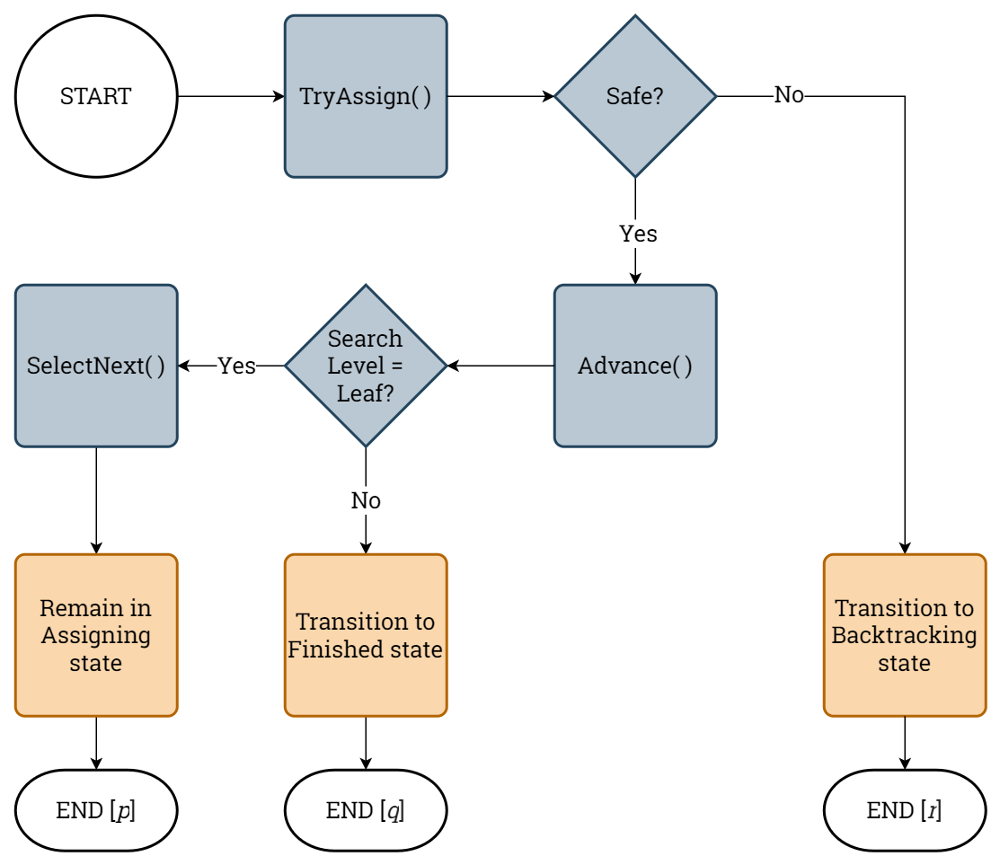
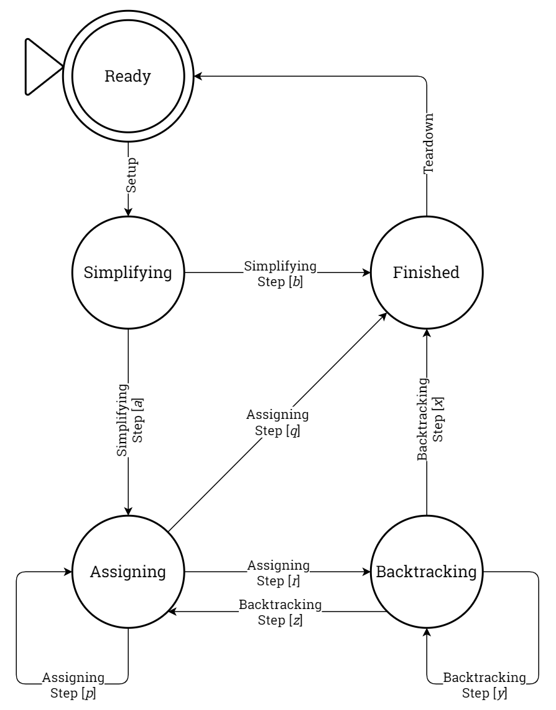

# Binary CSP Solving

This document outlines the binary CSP solving terminology used in the *Kolyteon* library.

- [Binary CSP Solving](#binary-csp-solving)
  - [General Backtracking Search Algorithm](#general-backtracking-search-algorithm)
  - [General Backtracking Search Algorithm as Finite State Automaton](#general-backtracking-search-algorithm-as-finite-state-automaton)
    - [Simplifying Step](#simplifying-step)
    - [Assigning Step](#assigning-step)
    - [Backtracking Step](#backtracking-step)
  - [Backtracking Search in Code](#backtracking-search-in-code)
    - [Strategy API Calls](#strategy-api-calls)
      - [`RootLevel` integer](#rootlevel-integer)
      - [`LeafLevel` integer](#leaflevel-integer)
      - [`SearchLevel` integer](#searchlevel-integer)
      - [`Safe` boolean](#safe-boolean)
      - [`Simplify( )` method](#simplify--method)
      - [`SelectNext( )` method](#selectnext--method)
      - [`Advance( )` method](#advance--method)
      - [`TryAssign( )` method](#tryassign--method)
      - [`Backtrack( )` method](#backtrack--method)
    - [Simplifying Step Algorithm](#simplifying-step-algorithm)
    - [Assigning Step Algorithm](#assigning-step-algorithm)
    - [Backtracking Step Algorithm](#backtracking-step-algorithm)
  - [Complete Binary CSP Solving Algorithm](#complete-binary-csp-solving-algorithm)
    - [Strategies](#strategies)
      - [Checking Strategy](#checking-strategy)
      - [Ordering Strategy](#ordering-strategy)
    - [Describing a Binary CSP Solving Algorithm](#describing-a-binary-csp-solving-algorithm)
    - [Binary CSP Solving Result](#binary-csp-solving-result)

## General Backtracking Search Algorithm

The general backtracking search algorithm is equivalent to the depth-first traversal of a search tree, where each node corresponds to a different partial or full solution to the binary CSP.

Given a binary CSP of *N* variables, the search tree has *N*+2 levels, indexed from -1 (root) to *N* (leaf).

- At the root level (-1), the root node represents the empty solution. All binary CSP variables are yet to be assigned values.
- At the leaf level (*N*), each leaf node represents a different full solution. All binary CSP variables have been assigned values.
- At each intervening level 0 - (*N*-1), each leaf node represents a different partial solution. Zero or more variables have been assigned values, zero or more variables are yet to be assigned values, and one variable (the present variable) is being considered.

The general backtracking search algorithm starts at the root node, simplifies the binary CSP, and attempts to determine if it cannot be solved. If the binary CSP evidently has no solution, the search algorithm terminates at the root, otherwise it advances to intervening level 0.

Thereafter, the search algorithm attempts to find a consistent assignment for the present variable. If this is achieved, the algorithm advances to the next level. If not, the algorithm backtracks to an earlier level.

The above step loops until the algorithm reaches either a leaf node or the root node.

When the algorithm terminates at a leaf node, the assignments constitute a consistent full solution to the binary CSP. When the algorithm terminates at the root node, the binary CSP has no solution.

## General Backtracking Search Algorithm as Finite State Automaton

The general backtracking search algorithm is formulated as a non-deterministic finite state automaton (NDFA), shown below.

|  |
|:-------------------------------------------------------------------------------------------------------:|
|                             General backtracking search algorithm as NDFA.                              |

The NDFA has four states: { `Simplifying`, `Assigning`, `Backtracking`, `Finished` }. The initial state is `Simplifying` and the terminal state is `Finished`.

The NDFA has eight possible transitional steps.

### Simplifying Step

A simplifying step is executed when the search is in `Simplifying` state.

During this step, the search simplifies the binary CSP and attempts to determine if it cannot be solved.

The simplifying step has two possible outcomes, labelled *a* and *b*.

| Label |          Transition          | Details                                                                                 |
|:-----:|:----------------------------:|:----------------------------------------------------------------------------------------|
|  *a*  | `Simplifying` -> `Assigning` | Binary CSP may be solvable. Search has advanced to level 0. Invoke assigning step next. |
|  *b*  | `Simplifying` -> `Finished`  | Search has terminated at root level. Binary CSP has no solution.                        |

### Assigning Step

An assigning step is executed when the search is in `Assigning` state.

During this step, the search tries to find a consistent assignment from the domain of the present variable. If this is achieved, the search advances to the next level. If the present variable's domain is exhausted without finding a consistent assignment, the search remains at its present level.

The assigning step has three possible outcomes, labelled *p*, *q* and *r*.

| Label |          Transition           | Details                                                                                                                                                    |
|:-----:|:-----------------------------:|:-----------------------------------------------------------------------------------------------------------------------------------------------------------|
|  *p*  |  `Assigning` -> `Assigning`   | Consistent assignment made. Search has advanced to next (non-leaf) level. Invoke assigning step next.                                                      |
|  *q*  |   `Assigning` -> `Finished`   | Consistent assignment made. Search has advanced to leaf level. Search has terminated at leaf level. Consistent full solution to binary CSP has been found. |
|  *r*  | `Assigning` -> `Backtracking` | Present variable's domain is exhausted without finding consistent assignment. Search has remained at present level. Invoke backtracking step next.         |

### Backtracking Step

A backtracking step is executed when the search is in `Backtracking` state.

During this step, the search backtracks to an earlier level, undoing the work at intervening levels.

The backtracking step has three possible outcomes, labelled *x*, *y* and *z*.

| Label |            Transition            | Details                                                                                                                         |
|:-----:|:--------------------------------:|:--------------------------------------------------------------------------------------------------------------------------------|
|  *x*  |   `Backtracking` -> `Finished`   | Search has backtracked to root level. Search has terminated at root level. Binary CSP has no solution.                          |
|  *y*  | `Backtracking` -> `Backtracking` | Search has backtracked to earlier (non-root) level. New present variable's domain is exhausted. Invoke backtracking step next.  |
|  *z*  |  `Backtracking` -> `Assigning`   | Search has backtracked to earlier (non-root) level. New present variable's domain is not exhausted. Invoke assigning step next. |

## Backtracking Search in Code

### Strategy API Calls

The following strategy API properties and methods will be invoked by the backtracking search algorithm.

#### `RootLevel` integer

This property returns the root level of the search tree. It has a constant value of -1.

#### `LeafLevel` integer

This property returns the leaf level of the search tree.

#### `SearchLevel` integer

This property returns the present level of the search in the search tree.

#### `Safe` boolean

This property returns `true` if the present state of the search is such that the leaf level can be reached, or `false` if the leaf level is out of reach.

#### `Simplify( )` method

This method simplifies the problem and attempts to determine whether the binary CSP has no solution. It updates `Safe` before it terminates.

#### `SelectNext( )` method

This method selects the next variable for assignment.

#### `Advance( )` method

This method advances to the next level of the search tree (by incrementing `SearchLevel`).

#### `TryAssign( )` method

This method attempts to find a consistent assignment for the present variable. It does this as follows:

1. Select the first remaining value in the variable's domain.
2. Assign the selected value to the variable.
3. Check the safety of the assignment.
4. If the safety check fails, undo the assignment, reject the domain value, and go back to 1.

This algorithm loops until either a safe assignment is made (`Safe` is set to `true`) or the domain is exhausted (`Safe` set to `false`).

#### `Backtrack( )` method

This method restores all the rejected domain values for the present variable. The search backtracks to an earlier level (by repeatedly decrementing `SearchLevel`), undoing assignments at any intervening levels.

When the search level has reached the backtrack level:

- If this is the root level, `Safe` is set to `false`. Otherwise,
  - If the new present variable has at least one domain value left to try as an assignment, `Safe` is set to `true`. Otherwise,
  - `Safe` is set to `false`.

### Simplifying Step Algorithm

The [simplifying step](#simplifying-step) is outlined in the flowchart below. State transitions are orange. Strategy API invocations are grey.

|  |
|:----------------------------------------------------------------------------:|
|                         Simplifying step algorithm.                          |

### Assigning Step Algorithm

The [assigning step](#assigning-step) is outlined in the flowchart below. State transitions are orange. Strategy API invocations are grey.

|  |
|:------------------------------------------------------------------------:|
|                        Assigning step algorithm.                         |

### Backtracking Step Algorithm

The [backtracking step](#backtracking-step) is outlined in the flowchart below. State transitions are orange. Strategy API invocations are grey.

|  |
|:------------------------------------------------------------------------------:|
|                          Backtracking step algorithm.                          |

## Complete Binary CSP Solving Algorithm

The general backtracking search algorithm is extended to a complete binary CSP solving algorithm in the NDFA below.

|  |
|:-------------------------------------------------------------------------------------------------:|
|                            Complete binary CSP solving algorithm NDFA.                            |

The NDFA has 5 states: {`Ready`, `Simplifying`, `Assigning`, `Backtracking` `Finished`}.

The `Ready` state is the initial and terminal state of the algorithm. This represents a binary CSP solver object with empty internal data structures and default values, ready to solve another binary CSP.

Two additional steps - setup and teardown - facilitate entrance into and exit from the backtracking search algorithm.

### Strategies

The general backtracking search can be modified by varying the execution of the various strategy API calls using strategies. These strategies work using the integer- and real-value measurements of the binary CSP, without reference to the underlying variable and domain value types.

#### Checking Strategy

A checking strategy determines how the safety of an assignment is checked, how the binary CSP is simplified, and how the backtracking level is determined.

Eight checking strategies will be implemented.

| Code |           Full Name           | Checking Strategy Type |
|:----:|:-----------------------------:|:----------------------:|
|  BT  |      Naive Backtracking       |     Retrospective      |
|  BJ  |          Backjumping          |     Retrospective      |
| GBJ  |    Graph-Based Backjumping    |     Retrospective      |
| CBJ  | Conflict-Directed Backjumping |     Retrospective      |
|  FC  |       Forward Checking        |      Prospective       |
| PLA  |     Partial Looking Ahead     |      Prospective       |
| FLA  |      Full Looking Ahead       |      Prospective       |
| MAC  |  Maintaining Arc Consistency  |      Prospective       |

Retrospective checking strategies work by checking the consistency of the present variable's assignment against the past assignments. Prospective checking strategies work by propagating the consequences of the present assignment through the domains of the future variables to see if the present assignment makes an assignment impossible for a future variable. Prospective strategies are generally superior to look-back strategies.

#### Ordering Strategy

An ordering strategy determines the ordering of variables in the search.

Four ordering strategies will be implemented.

| Code |       Full Name       |
|:----:|:---------------------:|
|  NO  |   Natural Ordering    |
|  BZ  | Br&#233;laz Heuristic |
|  MC  |    Max Cardinality    |
|  MT  |     Max Tightness     |

### Describing a Binary CSP Solving Algorithm

A binary CSP solving algorithm is composed of a checking strategy and an ordering strategy. It is identified by the concatenation of its strategy codes. For example:

- `"BT+NO"`: Naive Backtracking with Natural Ordering
- `"MAC+BZ"`: Maintaining Arc Consistency with Br&#233;laz Heuristic
- `"GBJ+MT"`: Graph-Based Backjumping with Max Tightness

Checking strategy and ordering strategy are separately interchangeable when the solver is in the `Ready` state.

### Binary CSP Solving Result

The binary CSP solving algorithm returns a data structure containing the following:

- A list of the assignments, constituting the consistent full solution that was found, or an empty list if no solution found.
- The backtracking search algorithm that was used.
- The number of simplifying steps (always 1).
- The number of assigning steps (always &ge; 0).
- The number of backtracking steps (always &ge; 0).
