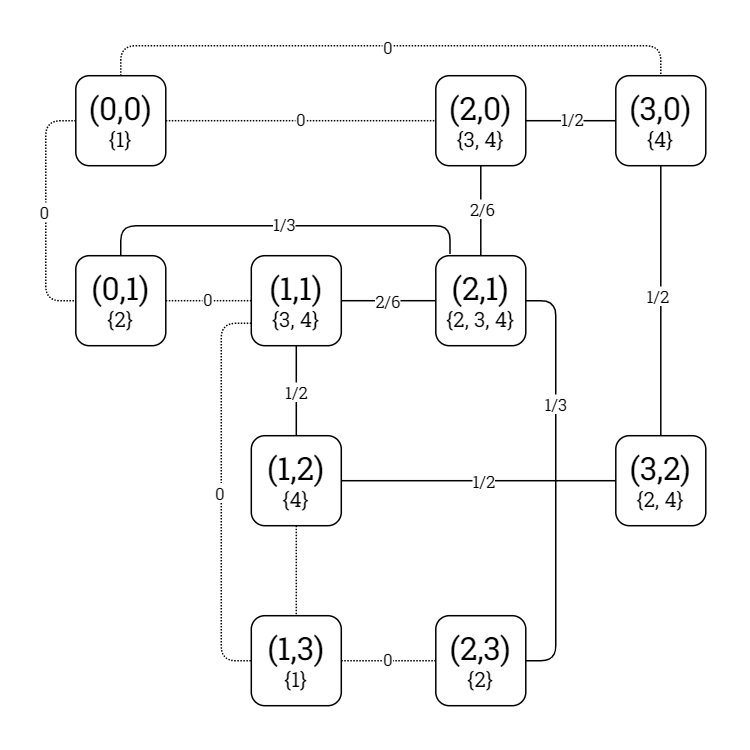

# Problem Definition: Futoshiki

This document defines the Futoshiki problem type as it is to be represented and modelled in the *Kolyteon* library.

- [Problem Definition: Futoshiki](#problem-definition-futoshiki)
  - [Example Problem and Solution](#example-problem-and-solution)
  - [Problem Rules](#problem-rules)
  - [Code Representation](#code-representation)
    - [Problem Grid Indexing](#problem-grid-indexing)
    - [Common Element Types](#common-element-types)
    - [`GreaterThanSign` readonly record struct](#greaterthansign-readonly-record-struct)
    - [`LessThanSign` readonly record struct](#lessthansign-readonly-record-struct)
    - [`FutoshikiProblem` record](#futoshikiproblem-record)
    - [`IReadOnlyList<NumberedSquare>` list](#ireadonlylistnumberedsquare-list)
  - [Solution Verification](#solution-verification)
  - [Binary CSP Modelling](#binary-csp-modelling)
    - [Variables](#variables)
    - [Domains](#domains)
    - [Constraints](#constraints)
    - [Constraint Graph of Example Problem](#constraint-graph-of-example-problem)
    - [`FutoshikiConstraintGraph` class](#futoshikiconstraintgraph-class)

## Example Problem and Solution

This document uses the example Futoshiki problem shown below, with a solution.

|  |  |
|:--------------------------------------------------------------------------:|:-----------------------------------------------------------------------------------------:|
|                         Example Futoshiki problem.                         |                            Example Futoshiki problem, solved.                             |

## Problem Rules

A Futoshiki problem consists of an *N*x*N* grid of squares, for a fixed value *N* &isin; [4, 9]. Some of the squares contain fixed numbers from the range [1, *N*]. Greater than (>) and less than (<) signs are located between some pairs of adjacent squares.

To solve the problem, one must fill every empty square with a number from the range [1, *N*], so that the numbers from 1 to *N* occur exactly once in every column and every row and every greater than and less than sign is true for its adjacent square pair.

## Code Representation

### Problem Grid Indexing

The problem grid's columns are zero-indexed from left to right. Its rows are zero-indexed from top to bottom. A square in the problem grid is identified by its (Column, Row) tuple.

The below diagram shows the example problem grid with its columns and rows labelled.

|  |
|:---------------------------------------------------------------------------------------------------------------:|
|                               Example Futoshiki problem (solved), labelled grid.                                |

### Common Element Types

The Futoshiki problem type uses the following [common types](problem_definition_common_elements.md):

- `Square`
- `NumberedSquare`
- `Dimensions`
- `Block`

### `GreaterThanSign` readonly record struct

- A `GreaterThanSign` instance represents a greater than (>) sign between two adjacent squares in the problem grid.
- A `GreaterThanSign` is a (`FirstSquare`, `SecondSquare`) tuple, where:
  - `FirstSquare` is the first `Square` value, and
  - `SecondSquare` is the second `Square` value.
- Two `GreaterThanSign` instances are compared by `FirstSquare`, then by `SecondSquare`.
- The string representation of the greater than sign between the square at column 1, row 2 and the square at column 2, row 2 is `"(1,2) > (2,2)"`.

### `LessThanSign` readonly record struct

- A `LessThanSign` instance represents a less than (<) sign between two adjacent squares in the problem grid.
- A `LessThanSign` is a (`FirstSquare`, `SecondSquare`) tuple, where:
  - `FirstSquare` is the first `Square` value, and
  - `SecondSquare` is the second `Square` value.
- Two `LessThanSign` instances are compared by `FirstSquare`, then by `SecondSquare`.
- The string representation of the less than sign between the square at column 0, row 0 and the square at column 0, row 1 is `"(0,0) > (0,1)"`.

### `FutoshikiProblem` record

- A `FutoshikiProblem` instance is an immutable, JSON-serializable data structure representing a valid (but not necessarily solvable) Futoshiki problem.
- A `FutoshikiProblem` is a (`Grid`, `MaxNumber`, `FixedNumbers`, `GreaterThanSigns`, `LessThanSigns`) tuple, where:
  - `Grid` is a `Block` representing the problem grid, and
  - `MaxNumber` is an integer in the range [4, 9] indicating the range of numbers to be added, and
  - `FixedNumbers` is an immutable list of `NumberedSquare` values denoting the fixed numbers in the problem grid, and
  - `GreaterThanSigns` is an immutable list of `GreaterThanSign` values denoting the greater than signs in the problem grid, and
  - `LessThanSigns` is an immutable list of `LessThanSign` values denoting the less than signs in the problem grid.
- A `FutoshikiProblem` can verify it is solved by a proposed solution.

### `IReadOnlyList<NumberedSquare>` list

- The solution to a `FutoshikiProblem` is an `IReadOnlyList<NumberedSquare>`.
- This represents the numbers that are to be added into the problem grid.

## Solution Verification

Given a `FutoshikiProblem` problem instance and an `IReadOnlyList<NumberedSquare>` solution instance, the problem is solved by the solution if all the following conditions are satisfied:

1. The quantity of numbered squares in the solution is equal to the quantity of fixed numbers in the problem subtracted from the problem grid area.
2. Every numbered square in the solution has a unique square.
3. Every numbered square in the solution has a number in the range [1, `MaxNumber`].
4. Every numbered square in the solution has a square that fits inside the problem grid.
5. Every numbered square in the solution has a square that is not a fixed number in the problem.
6. When the fixed numbers in the problem and the numbered squares in the solution are combined, the numbers 1-`MaxNumber` occur once in every column.
7. When the fixed numbers in the problem and the numbered squares in the solution are combined, the numbers 1-`MaxNumber` occur once in every row.
8. When the fixed numbers in the problem and the numbered squares in the solution are combined, every greater than sign in the problem is satisfied.
9. When the fixed numbers in the problem and the numbered squares in the solution are combined, every less than sign in the problem is satisfied.

## Binary CSP Modelling

### Variables

The binary CSP variables are the ordered set of all empty squares in the problem grid.

### Domains

The domain of a square variable is the ordered list of possible integers that may fill that square. For a problem of size *N*, a square's domain is generated using the following algorithm:

1. Start with the set of all consecutive numbers {1, 2, ..., *N*}.
2. For every fixed number in the same column or row as the present square, eliminate that number.
3. For every fixed number in an adjacent square where the present square is greater than the adjacent square, eliminate all numbers less than or equal to the fixed number.
4. For every fixed number in an adjacent square where the present square is less than the adjacent square, eliminate all numbers greater than or equal to the fixed number.

### Constraints

A theoretical binary constraint exists between every pair of square variables that are in the same column or row.

If the first and second square variable are adjacent and there is a greater than (>) sign between them, the constraint predicate mandates that the first square variable must be assigned a greater integer value than the second square variable.

If the first and second square variable are adjacent and there is a less than (<) sign between them, the constraint predicate mandates that the first square variable must be assigned a smaller integer value than the second square variable.

In all other cases, the constraint predicate mandates that the two square variables must be assigned unequal domain values.

A proven binary constraint only exists for a theoretically adjacent variable pair if there is at least one integer value pair from their domains that violates the particular constraint predicate.

### Constraint Graph of Example Problem

The constraint graph of the binary CSP modelling the example problem is shown in the diagrams below.

|  |
|:------------------------------------------------------------------------------------------------------------------------------------------:|
|                                   Example Futoshiki problem, constraint graph (theoretical constraints).                                   |

|  |
|:--------------------------------------------------------------------------------------------------------------------------------:|
|                                Example Futoshiki problem, constraint graph (proven constraints).                                 |

### `FutoshikiConstraintGraph` class

- A `FutoshikiConstraintGraph` instance:
  - extends `ConstraintGraph<Square, int, FutoshikiProblem>`,
  - implements `IModellingBinaryCsp<Square, int, FutoshikiProblem>`, and
  - implements `ISolvableBinaryCsp<Square, int>`.

The `FutoshikiConstraintGraph` class can model any valid Futoshiki problem as a binary CSP.
