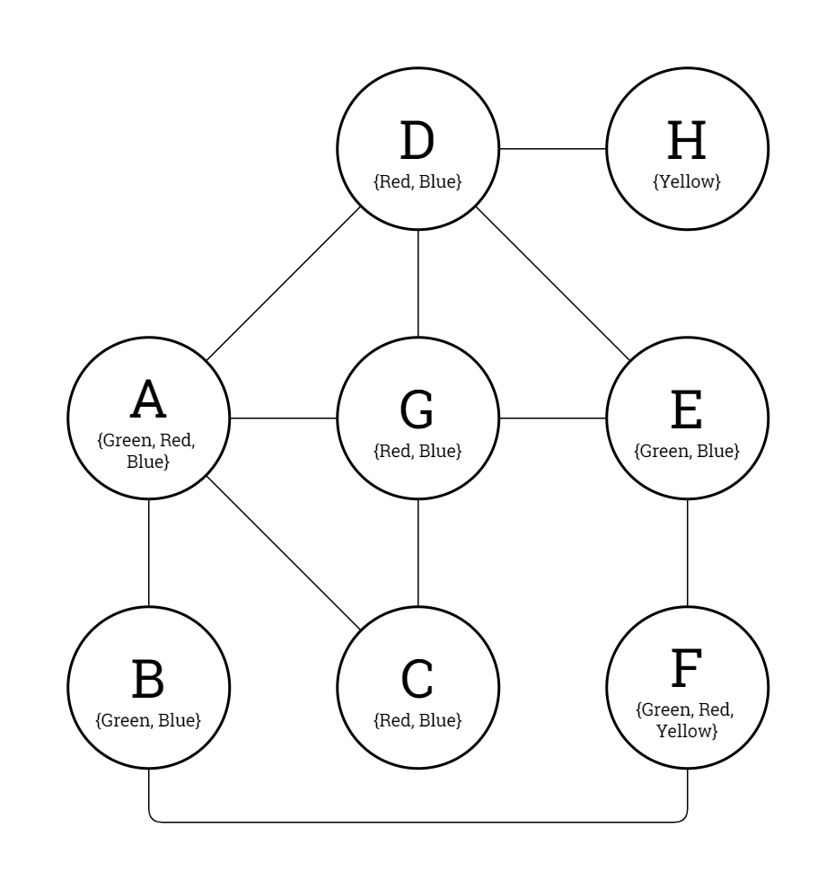
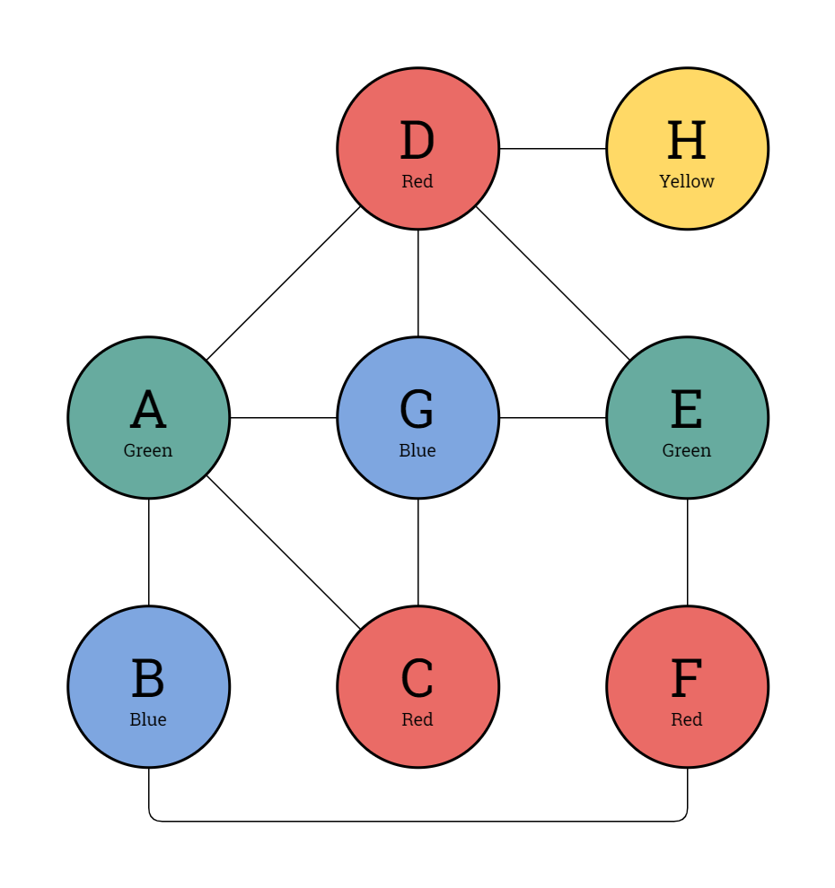
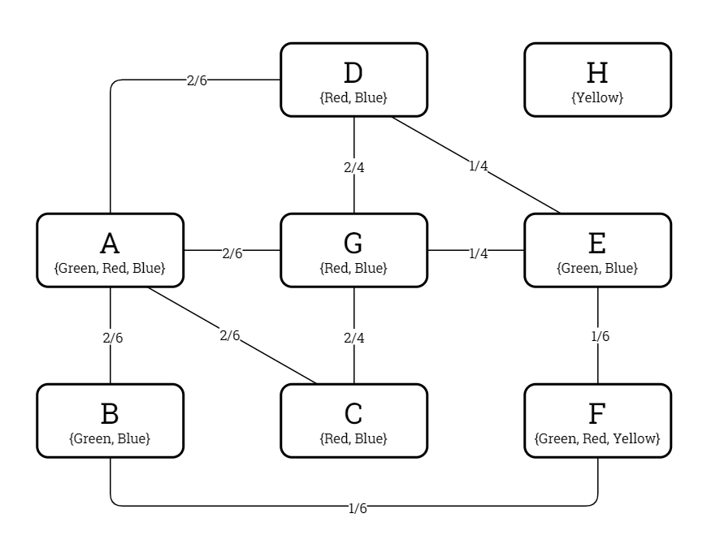

# Problem Definition: Graph Colouring

This document defines the Graph Colouring problem type as it is to be represented and modelled in the *Kolyteon* library.

- [Problem Definition: Graph Colouring](#problem-definition-graph-colouring)
  - [Example Problem and Solution](#example-problem-and-solution)
  - [Problem Rules](#problem-rules)
  - [Code Representation](#code-representation)
    - [Common Element Types](#common-element-types)
    - [`Node` readonly record struct](#node-readonly-record-struct)
    - [`NodeDatum` record](#nodedatum-record)
    - [`Edge` record](#edge-record)
    - [`GraphColouringProblem` record](#graphcolouringproblem-record)
    - [`IReadOnlyDictionary<Node, Colour>` dictionary](#ireadonlydictionarynode-colour-dictionary)
  - [Solution Verification](#solution-verification)
  - [Binary CSP Modelling](#binary-csp-modelling)
    - [Variables](#variables)
    - [Domains](#domains)
    - [Constraints](#constraints)
    - [Constraint Graph of Example Problem](#constraint-graph-of-example-problem)
    - [`GraphColouringConstraintGraph` class](#graphcolouringconstraintgraph-class)

## Example Problem and Solution

This document uses the example Graph Colouring problem shown below, with a solution.

|  |  |
|:--------------------------------------------------------------------------------------:|:-----------------------------------------------------------------------------------------------------:|
|                            Example Graph Colouring problem.                            |                               Example Graph Colouring problem, solved.                                |

## Problem Rules

A Graph Colouring problem consists of a graph of nodes, some of which are connected with edges. Each node has a finite set of permitted colours. This may be a node-specific set, or a global permitted colours set for the entire graph.

To solve the problem, one must colour in every node with one of its permitted colours, so that no two connected nodes are the same colour.

The Graph Colouring problem is always solvable when the nodes represent the regions in a real, 2-dimensional map and there is a global set of 4 or more permitted colours.

## Code Representation

### Common Element Types

The Graph Colouring problem type uses the following [common type](problem_definition_common_elements.md):

- `Colour`

### `Node` readonly record struct

- A `Node` instance represents a specific, named node in a graph.
- A `Node` is a (`Name`) tuple, where:
  - `Name` is a non-empty, non-white-space string identifying the node.
- Two `Node` instances are compared by `Name`, using case-sensitive ordinal string comparison rules.
- The string representation of the node with the name `"r0"` is `"(r0)"`.

### `NodeDatum` record

- A `NodeDatum` instance contains all the data for a node in a graph.
- A `NodeDatum` is a (`Node`, `PermittedColours`) tuple, where:
  - `Node` is a `Node` value, and
  - `PermittedColours` is an immutable collection of `Colour` values.
- Two `NodeDatum` instances are compared by `Node` value.

### `Edge` record

- An `Edge` instance represents an edge connecting two ordered nodes in a graph.
- An `Edge` is a (`FirstNode`, `SecondNode`) tuple, where:
  - `FirstNode` is the first `Node` value, and
  - `SecondNode` is the second `Node` value.
- Two `Edge` instances are compared by `FirstNode`, then by `SecondNode`.
- The string representation `Edge` between the nodes with names `"r0"` and `"r1"` is `"(r0)-(r1)"`.

### `GraphColouringProblem` record

- A `GraphColouringProblem` instance is an immutable, JSON-serializable data structure representing a valid (but not necessarily solvable) Graph Colouring problem.
- A `GraphColouringProblem` is a (`NodeData`, `Edges`) tuple, where:
  - `NodeData` is an immutable list of `NodeDatum` objects, and
  - `Edges` is an immutable list of `Edge` values.
- A `GraphColouringProblem` can verify it is solved by a proposed solution.

### `IReadOnlyDictionary<Node, Colour>` dictionary

- The solution to an `GraphColouringProblem` is an `IReadOnlyDictionary<Node, Colour>`.
- This represents the colours that are to be assigned to the nodes.

## Solution Verification

Given a `GraphColouringProblem` problem instance and an `IReadOnlyDictionary<Node, Colour>` solution instance, the problem is solved by the solution if all the following conditions are satisfied:

1. The number of entries in the solution is equal to the number of node data in the problem.
2. For every node datum in the problem, the node is a key in the solution.
3. For every node datum in the problem, the node is assigned one of its permitted colours in the solution.
4. For every edge datum in the problem, the two adjacent nodes are assigned unequal colours in the solution.

## Binary CSP Modelling

### Variables

The binary CSP variables are the ordered set of graph nodes.

### Domains

The domain of a graph node variable is its ordered set of permitted colours.

### Constraints

A theoretical binary constraint exists between every pair of graph node variables that are adjacent in the graph.

The predicate mandates that the two node variables must be assigned unequal colour values.

A proven binary constraint only exists for a theoretically adjacent node variable pair if there is at least one colour value that occurs in both their domains.

### Constraint Graph of Example Problem

The constraint graph of the binary CSP modelling the example problem is shown in the diagrams below.

|  |
|:------------------------------------------------------------------------------------------------------------------------------------------------------:|
|                                      Example Graph Colouring problem, constraint graph (theoretical constraints).                                      |

|  |
|:--------------------------------------------------------------------------------------------------------------------------------------------:|
|                                   Example Graph Colouring problem, constraint graph (proven constraints).                                    |

### `GraphColouringConstraintGraph` class

- A `GraphColouringConstraintGraph` instance:
  - extends `ConstraintGraph<Node, Colour, GraphColouringProblem>`,
  - implements `IBinaryCsp<Node, Colour, GraphColouringProblem>`, and
  - implements `IReadOnlyBinaryCsp<Node, Colour>`.

The `GraphColouringConstraintGraph` class can model any valid Graph Colouring problem as a binary CSP.
