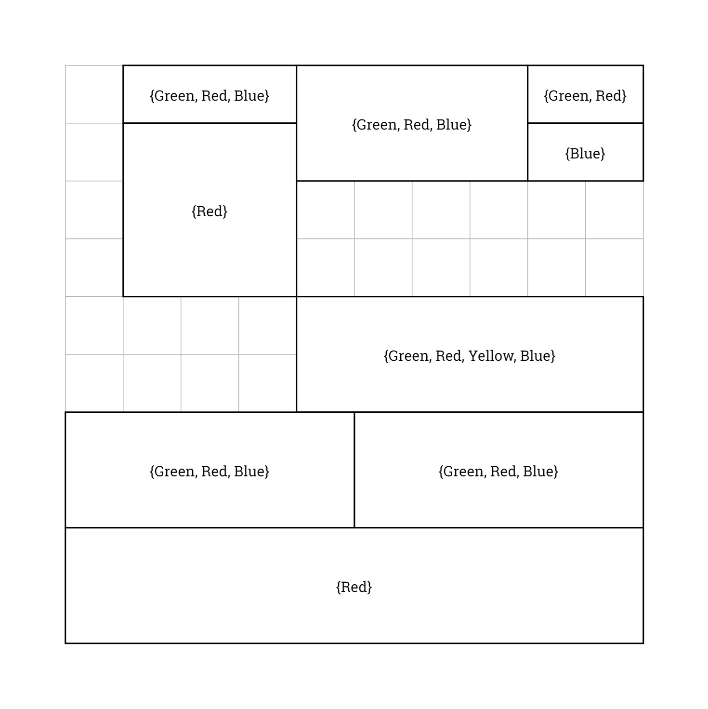
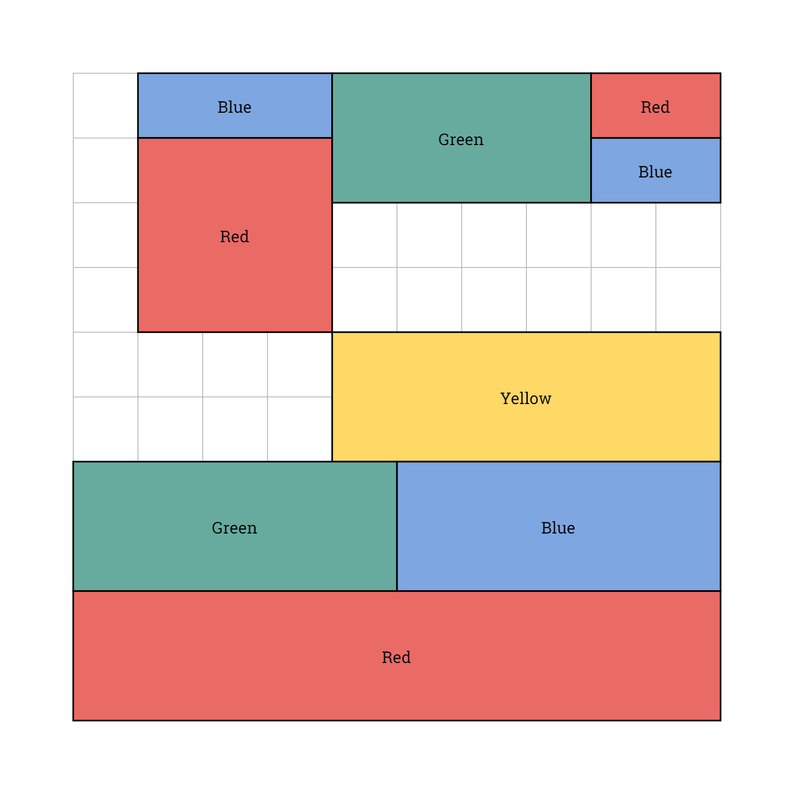
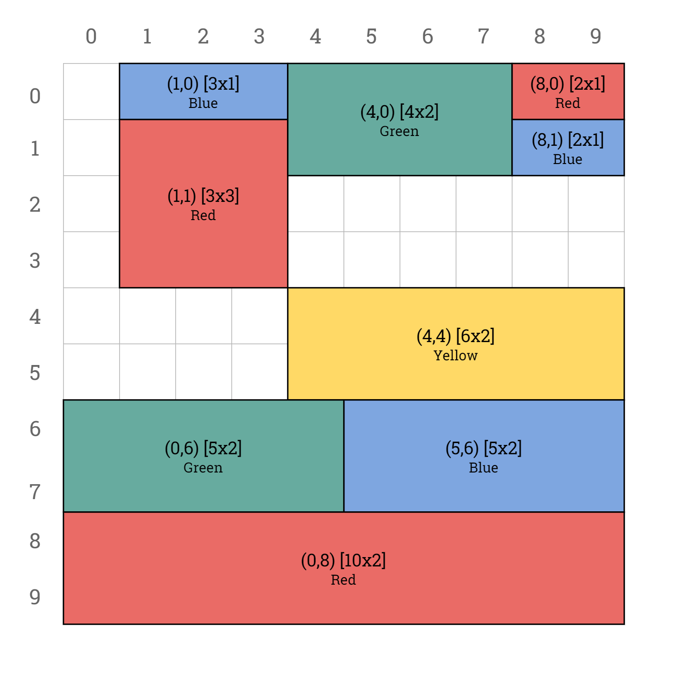
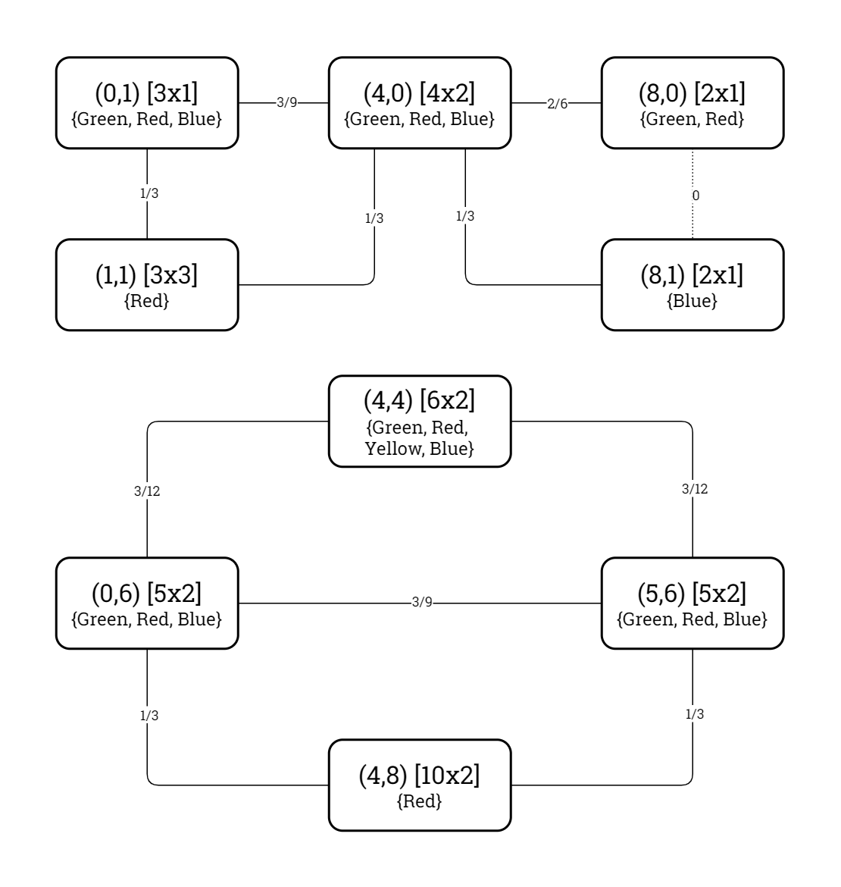

# Problem Definition: Map Colouring

This document defines the Map Colouring problem type as it is to be represented and modelled in the *Kolyteon* library.

- [Problem Definition: Map Colouring](#problem-definition-map-colouring)
  - [Example Problem and Solution](#example-problem-and-solution)
  - [Problem Rules](#problem-rules)
  - [Code Representation](#code-representation)
    - [Problem Canvas Indexing](#problem-canvas-indexing)
    - [Common Element Types](#common-element-types)
    - [`BlockDatum` record](#blockdatum-record)
    - [`MapColouringProblem` record](#mapcolouringproblem-record)
    - [`IReadOnlyDictionary<Block, Colour>` dictionary](#ireadonlydictionaryblock-colour-dictionary)
  - [Solution Verification](#solution-verification)
  - [Binary CSP Modelling](#binary-csp-modelling)
    - [Variables](#variables)
    - [Domains](#domains)
    - [Constraints](#constraints)
    - [Constraint Graph of Example Problem](#constraint-graph-of-example-problem)
    - [`MapColouringConstraintGraph` class](#mapcolouringconstraintgraph-class)

## Example Problem and Solution

This document uses the example Map Colouring problem shown below, with a solution.

|  |  |
|:----------------------------------------------------------------------------------:|:-------------------------------------------------------------------------------------------------:|
|                           Example Map Colouring problem.                           |                              Example Map Colouring problem, solved.                               |

## Problem Rules

A Map Colouring problem consists of a 2-dimensional canvas of square cells, containing a map of non-overlapping quadrilateral blocks. Each block has a finite set of permitted colours. This may be a block-specific set, or a global permitted colours set for the entire map.

To solve the problem, one must colour in every block with one of its permitted colours, so that no two adjacent blocks are the same colour.

The Map Colouring problem is always solvable when there is a global set of 4 or more permitted colours.

## Code Representation

### Problem Canvas Indexing

The problem canvas's columns are zero-indexed from left to right. Its rows are zero-indexed from top to bottom. A cell in the problem canvas is identified by its (Column, Row) tuple.

The below diagram shows the example problem canvas with its columns and rows labelled.

|  |
|:---------------------------------------------------------------------------------------------------------------------------:|
|                                  Example Map Colouring problem (solved), labelled canvas.                                   |

### Common Element Types

The Map Colouring problem type uses the following [common types](problem_definition_common_elements.md):

- `Square`
- `Dimensions`
- `Block`
- `Colour`

### `BlockDatum` record

- A `BlockDatum` instance contains all the data for a block in a map.
- A `BlockDatum` is a (`Block`, `PermittedColours`) tuple, where:
  - `Block` is a `Block` value.
  - `PermittedColours` is an immutable collection of `Colour` values.

### `MapColouringProblem` record

- A `MapColouringProblem` instance is an immutable, JSON-serializable data structure representing a valid (but not necessarily solvable) Map Colouring problem.
- A `MapColouringProblem` is a (`Canvas`,`BlockData`) tuple, where:
  - `Canvas` is a `Block` value defining the map canvas.
  - `BlockData` is an immutable list of `BlockDatum` objects.
- A `MapColouringProblem` can verify it is solved by a proposed solution.

### `IReadOnlyDictionary<Block, Colour>` dictionary

- The solution to an `MapColouringProblem` is an `IReadOnlyDictionary<Block, Colour>`.
- This represents the colours that are to be assigned to the blocks.

## Solution Verification

Given a `MapColouringProblem` problem instance and an `IReadOnlyDictionary<Block, Colour>` solution instance, the problem is solved by the solution if all the following conditions are satisfied:

1. The number of entries in the solution is equal to the number of block data in the problem.
2. For every block datum in the problem, the block is a key in the solution.
3. For every block datum in the problem, the block is assigned one of its permitted colours in the solution.
4. For every pair of adjacent blocks in the problem, the blocks are assigned unequal colours in the solution.

## Binary CSP Modelling

### Variables

The binary CSP variables are the ordered set of map blocks.

### Domains

The domain of a block variable is its ordered set of permitted colours.

### Constraints

A theoretical binary constraint exists between every pair of block variables that are adjacent in the map.

The predicate mandates that the two block variables must be assigned unequal colour values.

A proven binary constraint only exists for a theoretically adjacent block variable pair if there is at least one colour value that occurs in both their domains.

### Constraint Graph of Example Problem

The constraint graph of the binary CSP modelling the example problem is shown in the diagrams below.

|  |
|:--------------------------------------------------------------------------------------------------------------------------------------------------:|
|                                     Example Map Colouring problem, constraint graph (theoretical constraints).                                     |

|  |
|:----------------------------------------------------------------------------------------------------------------------------------------:|
|                                  Example Map Colouring problem, constraint graph (proven constraints).                                   |

### `MapColouringConstraintGraph` class

- A `MapColouringConstraintGraph` instance:
  - extends `ConstraintGraph<Block, Colour, MapColouringProblem>`,
  - implements `IModellingBinaryCsp<Block, Colour, MapColouringProblem>`, and
  - implements `ISolvableBinaryCsp<Block, Colour>`.

The `MapColouringConstraintGraph` class can model any valid Map Colouring problem as a binary CSP.
