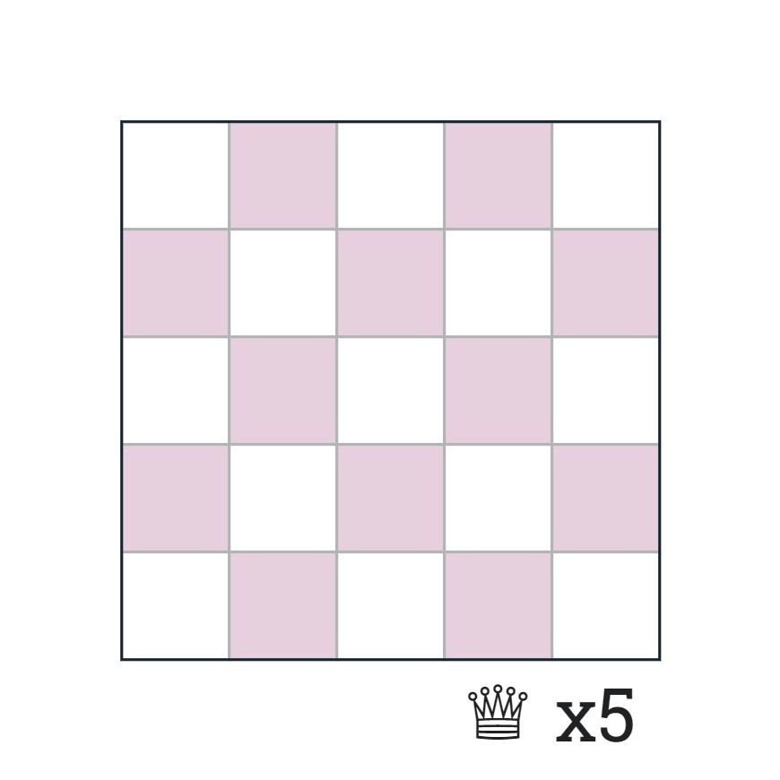
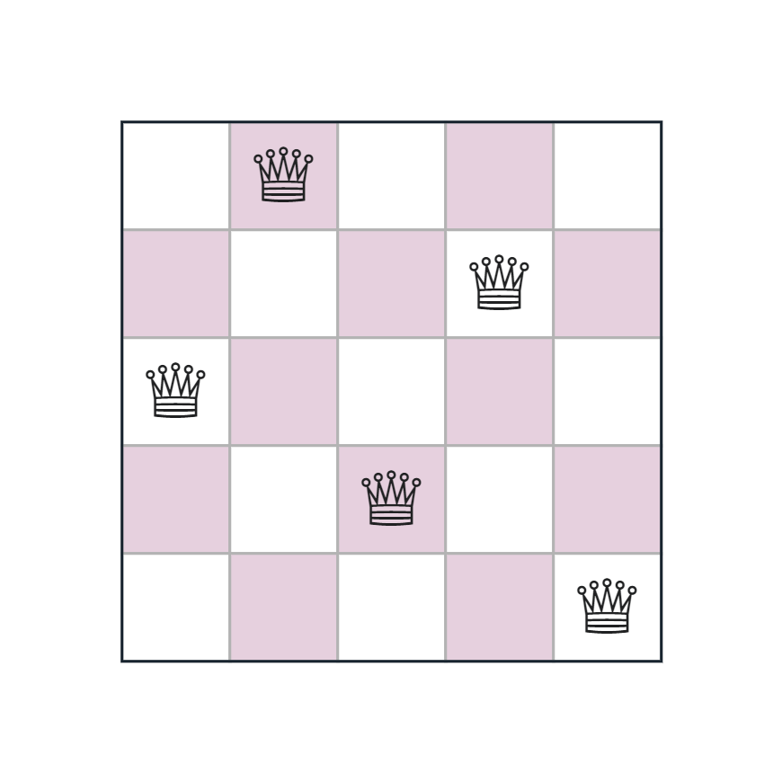
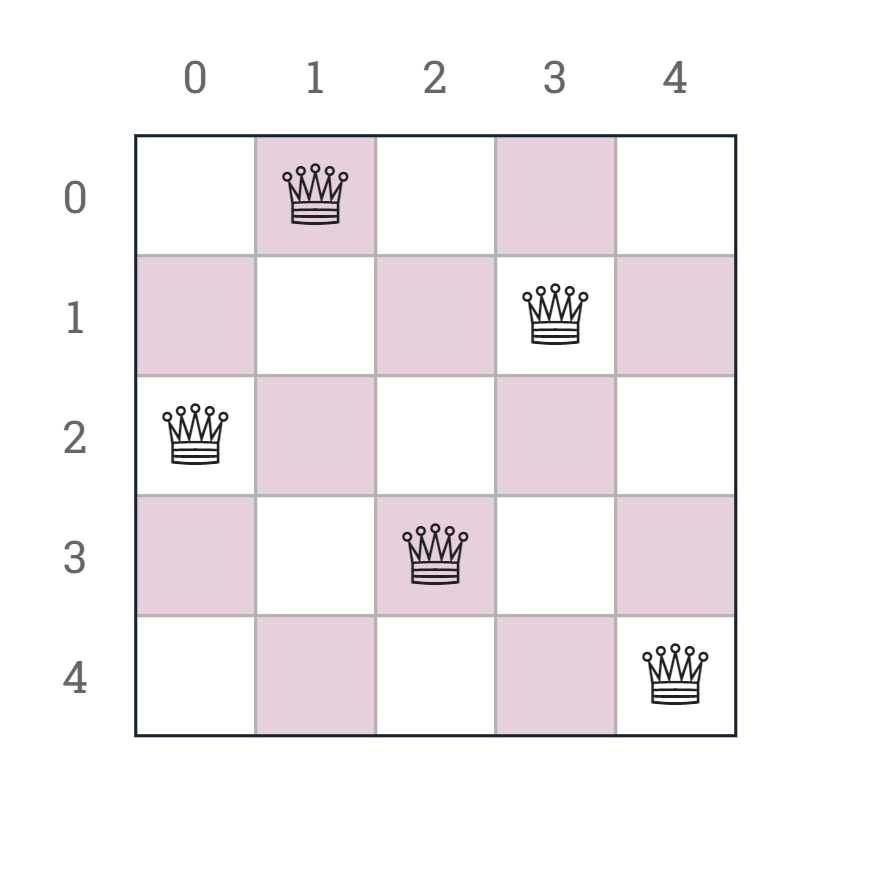
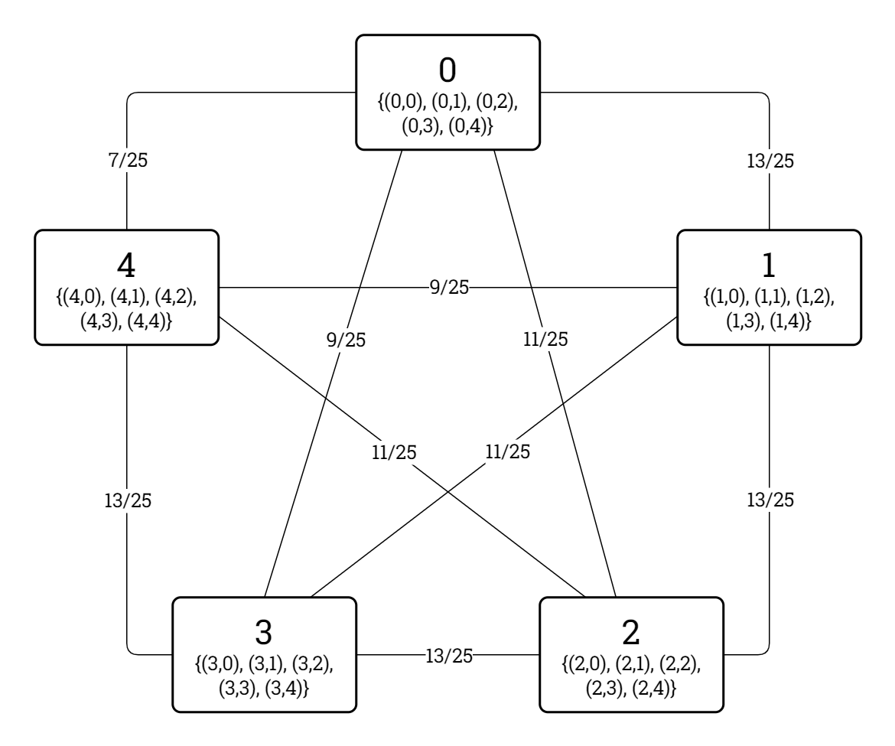

# Problem Definition: *N*-Queens

This document defines the *N*-Queens problem type as it is to be represented and modelled in the *Kolyteon* library.

- [Problem Definition: *N*-Queens](#problem-definition-n-queens)
  - [Example Problem and Solution](#example-problem-and-solution)
  - [Problem Rules](#problem-rules)
  - [Code Representation](#code-representation)
    - [Problem Chess Board Indexing](#problem-chess-board-indexing)
    - [Common Element Types](#common-element-types)
    - [`NQueensProblem` record](#nqueensproblem-record)
    - [`IReadOnlyList<Square>` list](#ireadonlylistsquare-list)
  - [Solution Verification](#solution-verification)
  - [Binary CSP Modelling](#binary-csp-modelling)
    - [Variables](#variables)
    - [Domains](#domains)
    - [Constraints](#constraints)
    - [Constraint Graph of Example Problem](#constraint-graph-of-example-problem)
    - [`NQueensConstraintGraph` class](#nqueensconstraintgraph-class)

## Example Problem and Solution

This document uses the example *N*-Queens problem shown below, with a solution.

|  |  |
|:------------------------------------------------------------------------:|:---------------------------------------------------------------------------------------:|
|                       Example *N*-Queens problem.                        |                           Example *N*-Queens problem, solved.                           |

## Problem Rules

An *N*-Queens problem consists of an *N*x*N* chess board and *N* queens, for a fixed value *N* &isin; &#8469;.

To solve the problem, one must place every queen on a different square on the chess board, so that no two queens can capture each other. Alternatively, one must place every queen in a unique column, row, and diagonal.

The *N*-Queens problem is solvable for every value of *N* &notin; {2, 3}.

## Code Representation

### Problem Chess Board Indexing

The problem chess board's columns are zero-indexed from left to right. Its rows are zero-indexed from top to bottom. A square on the problem chess board is identified by its (Column, Row) tuple.

The below diagram shows the example problem chess board with its columns and rows labelled.

|  |
|:---------------------------------------------------------------------------------------------------------------------------:|
|                                 Example *N*-Queens problem (solved), labelled chess board.                                  |

### Common Element Types

The *N*-Queens problem type uses the following [common types](problem_definition_common_elements.md):

- `Square`
- `Dimensions`
- `Block`

The `Square` type is extended with the ability to determine if a queen on that square captures a queen on a given square.

### `NQueensProblem` record

- An `NQueensProblem` instance is an immutable, JSON-serializable data structure represents a valid (but not necessarily solvable) *N*-Queens problem.
- An `NQueensProblem` is a (`ChessBoard`, `Queens`) tuple, where:
  - `ChessBoard` is a square `Block` representing the chess board, and
  - `Queens` is an integer &ge; 1 denoting the number of queens.
- An `NQueensProblem` can verify it is solved by a proposed solution.

### `IReadOnlyList<Square>` list

- The solution to an `NQueensProblem` is an `IReadOnlyList<Square>`.
- This represents the squares to be occupied by queens.

## Solution Verification

Given an `NQueensProblem` problem instance and an `IReadOnlyList<Square>` solution instance, the problem is solved by the solution if all the following conditions are satisfied:

1. The number of squares in the solution is equal to the number of queens in the problem.
2. Every square in the solution fits onto the chess board.
3. Every square in the solution is different.
4. No two squares in the solution capture each other.

## Binary CSP Modelling

### Variables

The binary CSP variables are the consecutive integer column indexes {0, 1, ..., (*N*-1)}.

### Domains

The domain of an integer column index variable is the ordered set of all squares in the column.

### Constraints

There is a theoretical and proven binary constraint between every pair of integer column index variables.

The constraint predicate mandates that the two column index variables must be assigned non-capturing square values.

A binary CSP modelling an *N*-Queens problem always has a constraint density of 1 when *N* > 1.

### Constraint Graph of Example Problem

The constraint graph of the binary CSP modelling the example problem is shown in the diagram below.

|  |
|:---------------------------------------------------------------------------------------------------------------------------------------:|
|                           Example *N*-Queens problem, constraint graph (theoretical and proven constraints).                            |

### `NQueensConstraintGraph` class

- An `NQueensConstraintGraph` instance:
  - extends `ConstraintGraph<int, Square, NQueensProblem>`,
  - implements `IBinaryCsp<int, Square, NQueensProblem>`, and
  - implements `IReadOnlyBinaryCsp<int, Square>`.

The `NQueensConstraintGraph` class can model any valid *N*-Queens problem as a binary CSP.
