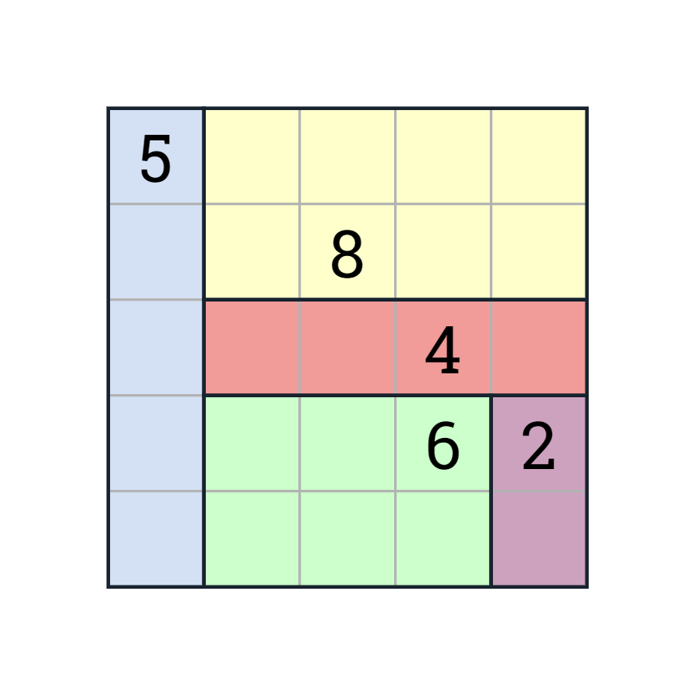
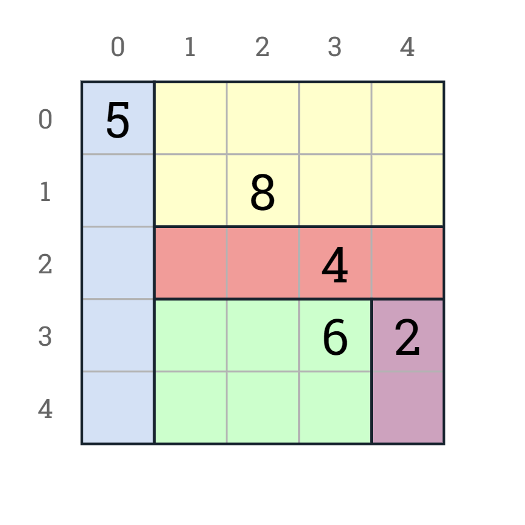
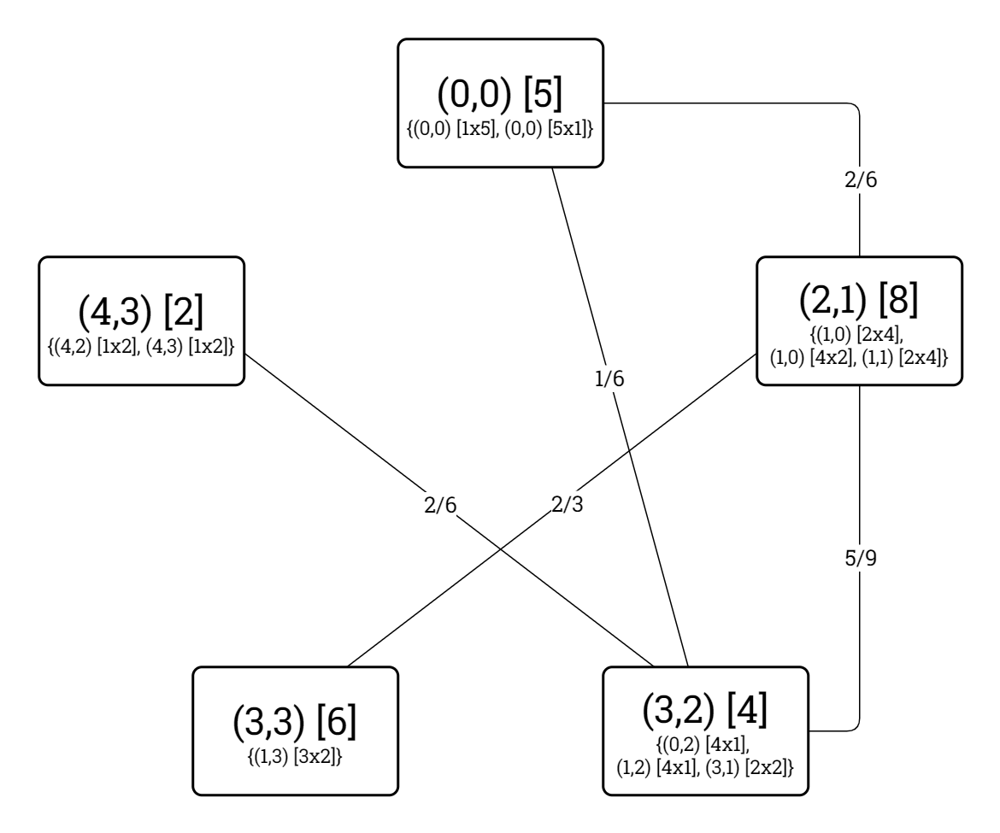

# Problem Definition: Shikaku

This document defines the Shikaku problem type as it is to be represented and modelled in the *Kolyteon* library.

- [Problem Definition: Shikaku](#problem-definition-shikaku)
  - [Example Problem and Solution](#example-problem-and-solution)
  - [Problem Rules](#problem-rules)
  - [Code Representation](#code-representation)
    - [Problem Grid Indexing](#problem-grid-indexing)
    - [Common Element Types](#common-element-types)
    - [`ShikakuProblem` record](#shikakuproblem-record)
    - [`IReadOnlyList<Block>` list](#ireadonlylistblock-list)
  - [Solution Verification](#solution-verification)
  - [Binary CSP Modelling](#binary-csp-modelling)
    - [Variables](#variables)
    - [Domains](#domains)
    - [Constraints](#constraints)
    - [Constraint Graph of Example Problem](#constraint-graph-of-example-problem)
    - [`ShikakuConstraintGraph` class](#shikakuconstraintgraph-class)

## Example Problem and Solution

This document uses the example Shikaku problem shown below, with a solution.

|  |  |
|:----------------------------------------------------------------------:|:-------------------------------------------------------------------------------------:|
|                        Example Shikaku problem.                        |                           Example Shikaku problem, solved.                            |

## Problem Rules

A Shikaku problem consists of an *N*x*N* grid of squares. Some of the squares contain numeric hints, whose values sum to the grid's area in squares.

The minimum permitted grid size is 5x5. The minimum permitted hint number is 2.

To solve the problem, one must partition the grid into rectangular/square blocks so that every block encloses exactly one hint, whose number value is equal to the block's area in squares. Alternatively, one must enclose every hint with a block whose area matches the hint's number, so that every block fits inside the grid and no two blocks overlap.

## Code Representation

### Problem Grid Indexing

The problem grid's columns are zero-indexed from left to right. Its rows are zero-indexed from top to bottom. A square in the problem grid is identified by its (Column, Row) tuple.

The below diagram shows the example problem grid with its columns and rows labelled.

|  |
|:-----------------------------------------------------------------------------------------------------------:|
|                              Example Shikaku problem (solved), labelled grid.                               |

### Common Element Types

The Shikaku problem type uses the following [common types](problem_definition_common_elements.md):

- `Square`
- `NumberedSquare`
- `Dimensions`
- `Block`

### `ShikakuProblem` record

- A `ShikakuProblem` instance is an immutable, JSON-serializable data structure representing a valid (but not necessarily solvable) Shikaku problem.
- A `ShikakuProblem` is a (`Grid`, `Hints`) tuple, where:
  - `Grid` is a `Block` representing the problem grid, and
  - `Hints` is an immutable list of `NumberedSquare` values denoting the problem hints.
- A `ShikakuProblem` can verify it is solved by a proposed solution.

### `IReadOnlyList<Block>` list

- The solution to a `ShikakuProblem` is an `IReadOnlyList<Block>`.
- This represents the blocks to be drawn onto the problem grid.

## Solution Verification

Given a `ShikakuProblem` problem instance and an `IReadOnlyList<Block>` solution instance, the problem is solved by the solution if all the following conditions are satisfied:

1. The number of blocks in the solution is equal to the number of hints in the problem.
2. The block areas in the solution sum to the problem grid area.
3. Every block in the solution fits inside the problem grid.
4. No two blocks in the solution overlap.
5. Every block in the solution contains only one hint.
6. Every block in the solution contains a hint with a number equal to the block's area.

## Binary CSP Modelling

### Variables

The binary CSP variables are the ordered set of problem hints.

### Domains

The domain of a hint variable is the ordered set of all possible blocks that have an area equal to the hint number *and* fit inside the grid *and* enclose the hint *and* enclose no other hint.

### Constraints

There is a theoretical binary constraint between every pair of hint variables for which the Manhattan distance between their squares is less than or equal to the greatest of their two numbers. This is an imprecise indicator of whether they could possibly have an overlapping block.

The constraint predicate mandates that the two hint variables must be assigned non-overlapping block values.

A proven binary constraint only exists for a theoretically adjacent hint variable pair if there exists at least one pair of overlapping variables from their respective domains.

### Constraint Graph of Example Problem

The constraint graph of the binary CSP modelling the example problem is shown in the diagrams below.

|  |
|:--------------------------------------------------------------------------------------------------------------------------------------:|
|                                  Example Shikaku problem, constraint graph (theoretical constraints).                                  |

|  |
|:----------------------------------------------------------------------------------------------------------------------------:|
|                               Example Shikaku problem, constraint graph (proven constraints).                                |

### `ShikakuConstraintGraph` class

- A `ShikakuConstraintGraph` instance:
  - extends `ConstraintGraph<NumberedSquare, Block, ShikakuProblem>`,
  - implements `IModellingBinaryCsp<NumberedSquare, Block, ShikakuProblem>`, and
  - implements `ISolvableBinaryCsp<NumberedSquare, Block>`.

The `ShikakuConstraintGraph` class can model any valid Shikaku problem as a binary CSP.
