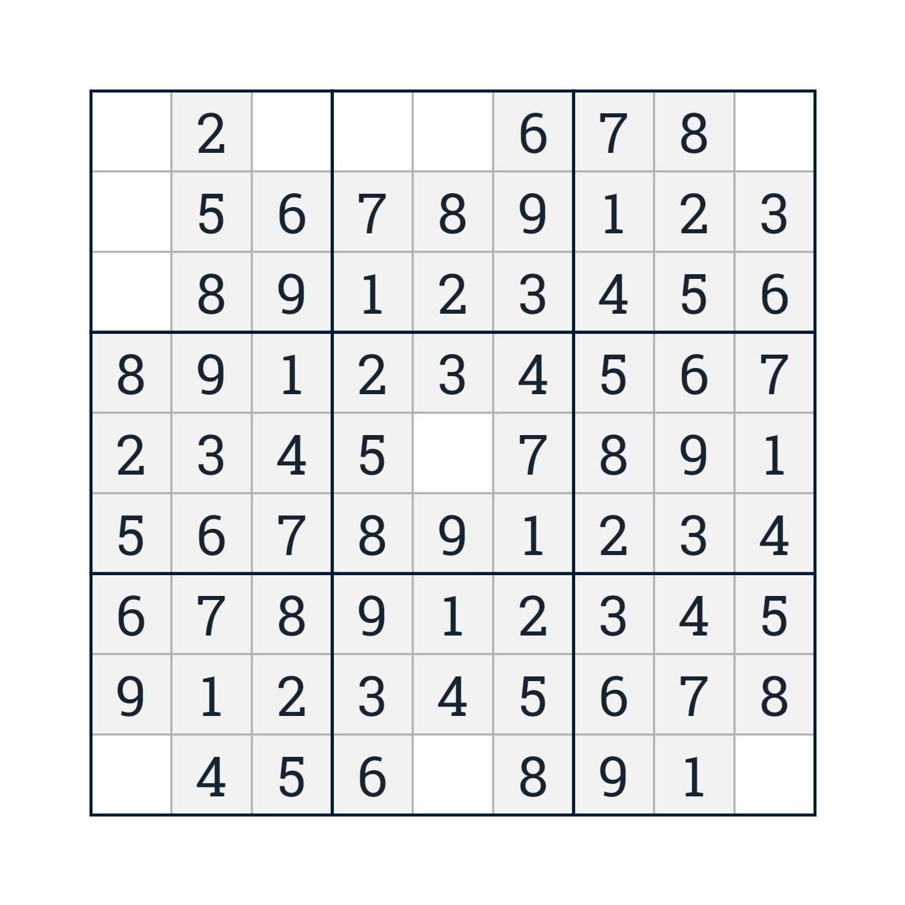
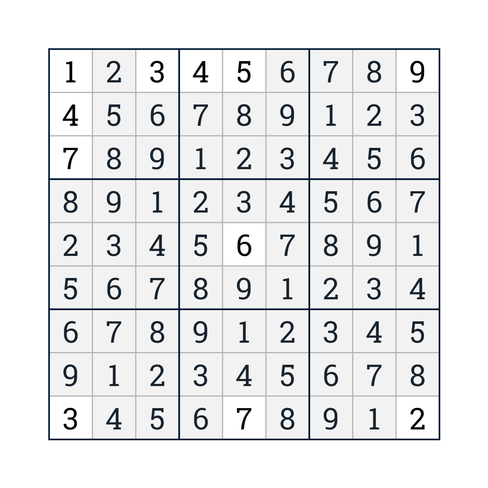
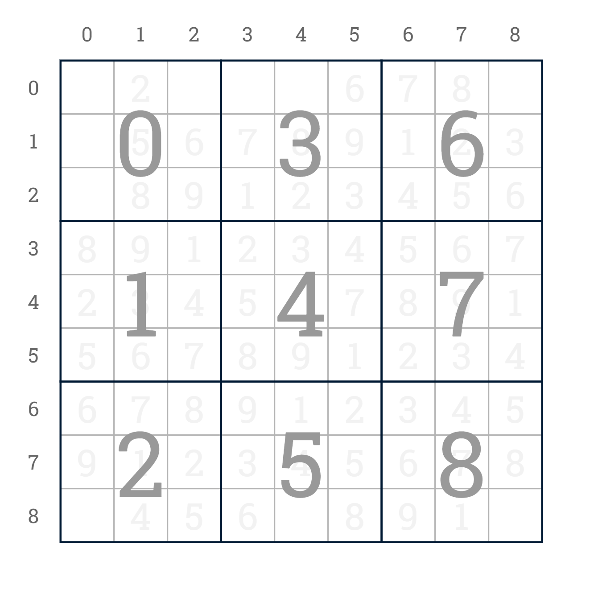
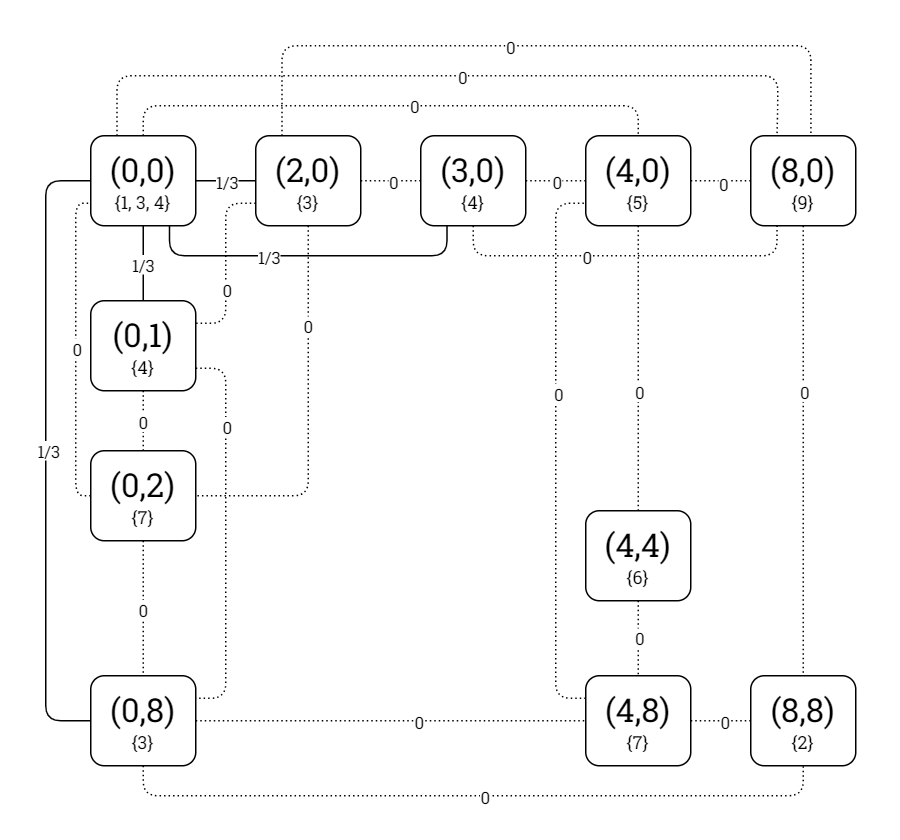
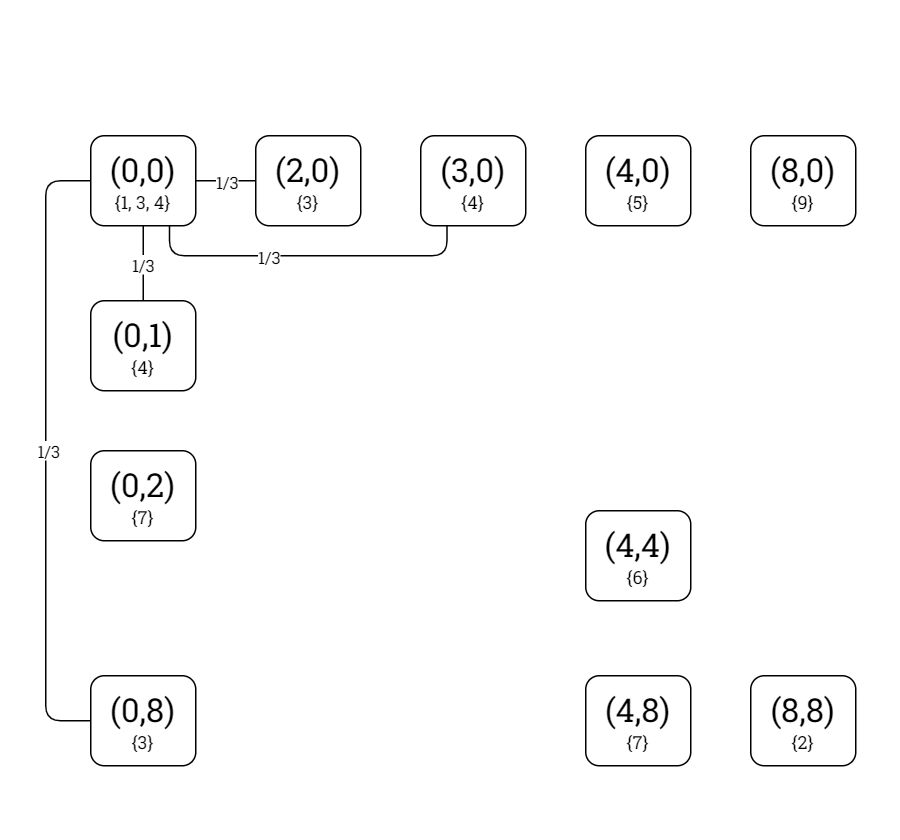

# Problem Definition: Sudoku

This document defines the Sudoku problem type as it is to be represented and modelled in the *Kolyteon* library.

- [Problem Definition: Sudoku](#problem-definition-sudoku)
  - [Example Problem and Solution](#example-problem-and-solution)
  - [Problem Rules](#problem-rules)
  - [Code Representation](#code-representation)
    - [Problem Grid Indexing](#problem-grid-indexing)
    - [Common Element Types](#common-element-types)
    - [`SudokuProblem` record](#sudokuproblem-record)
    - [`IReadOnlyList<NumberedSquare>` list](#ireadonlylistnumberedsquare-list)
  - [Solution Verification](#solution-verification)
  - [Binary CSP Modelling](#binary-csp-modelling)
    - [Variables](#variables)
    - [Domains](#domains)
    - [Constraints](#constraints)
    - [Constraint Graph of Example Problem](#constraint-graph-of-example-problem)
    - [`SudokuConstraintGraph` class](#sudokuconstraintgraph-class)

## Example Problem and Solution

This document uses the example Sudoku problem shown below, with a solution. A real-world Sudoku problem will have many more empty squares than the example.

|  |  |
|:--------------------------------------------------------------------:|:-----------------------------------------------------------------------------------:|
|                       Example Sudoku problem.                        |                           Example Sudoku problem, solved.                           |

## Problem Rules

A Sudoku problem consists of a 9x9 grid of squares, subdivided into 9 3x3 sectors. Some of the squares contain fixed numbers from the range [1, 9].

To solve the problem, one must fill in every empty square with a number from the range [1, 9], so that the numbers from 1 to 9 occur exactly once in every column, row, and sector.

## Code Representation

### Problem Grid Indexing

The problem grid's columns are zero-indexed from left to right. Its rows are zero-indexed from top to bottom. Its sectors are zero-indexed from top-left to bottom-right. A square in the problem grid is identified by its (Column, Row) tuple.

A square's sector is calculated as a function of its row and column as follows:

```csharp
Sector = Row / 3 + 3 * (Column / 3);
```

The below diagram shows the example problem grid with its columns, rows and sectors labelled.

|  |
|:---------------------------------------------------------------------------------------------------------:|
|                              Example Sudoku problem (solved), labelled grid.                              |

### Common Element Types

The Sudoku problem type uses the following [common types](problem_definition_common_elements.md):

- `Square`
- `NumberedSquare`
- `Dimensions`
- `Block`

The `Square` type is extended with a `Sector` value.

### `SudokuProblem` record

- A `SudokuProblem` instance is an immutable, JSON-serializable data structure representing a valid (but not necessarily solvable) Sudoku problem.
- A `SudokuProblem` is a (`Grid`, `Sectors`, `FixedNumbers`) tuple, where:
  - `Grid` is a `Block` value representing the problem grid, and
  - `Sectors` is an immutable list of `Block` values representing the 9 sectors of the problem grid, and
  - `FixedNumbers` is an immutable list of `NumberedSquare` values denoting the fixed numbers in the problem grid.
- A `SudokuProblem` can verify it is solved by a proposed solution.

### `IReadOnlyList<NumberedSquare>` list

- The solution to a `SudokuProblem` is an `IReadOnlyList<NumberedSquare>`.
- This represents the numbers that are to be added into the problem grid.

## Solution Verification

Given a `SudokuProblem` problem instance and an `IReadOnlyList<NumberedSquare>` solution instance, the problem is solved by the solution if all the following conditions are satisfied:

1. The quantity of numbered squares in the solution is equal to the quantity of fixed numbers in the problem subtracted from the problem grid area.
2. Every numbered square in the solution has a unique square.
3. Every numbered square in the solution has a number in the range [1, 9].
4. Every numbered square in the solution has a square that fits inside the problem grid.
5. Every numbered square in the solution has a square that is not a fixed number in the problem.
6. When the fixed numbers in the problem and the numbered squares in the solution are combined, the numbers 1-9 occur once in every column.
7. When the fixed numbers in the problem and the numbered squares in the solution are combined, the numbers 1-9 occur once in every row.
8. When the fixed numbers in the problem and the numbered squares in the solution are combined, the numbers 1-9 occur once in every sector.

## Binary CSP Modelling

### Variables

The binary CSP variables are the ordered set of all empty squares in the problem grid.

### Domains

The domain of a square variable is the set of all possible integers that may fill that square. This is generated using the following algorithm.

1. Start with the set of consecutive integers {1, 2, 3, 4, 5, 6, 7, 8, 9}.
2. For every fixed number in the same column as the present square, eliminate the number.
3. For every fixed number in the same row as the present square, eliminate the number.
4. For every fixed number in the same sector as the present square, eliminate the number.

### Constraints

A theoretical binary constraint exists between every pair of square variables that are in the same column, row, or sector.

The predicate mandates that the two square variables must be assigned unequal integer values.

A proven binary constraint only exists for a theoretically adjacent variable pair if there is at least one integer value that occurs in both their domains.

### Constraint Graph of Example Problem

The constraint graph of the binary CSP modelling the example problem is shown in the diagrams below.

|  |
|:------------------------------------------------------------------------------------------------------------------------------------:|
|                                 Example Sudoku problem, constraint graph (theoretical constraints).                                  |

|  |
|:--------------------------------------------------------------------------------------------------------------------------:|
|                               Example Sudoku problem, constraint graph (proven constraints).                               |

### `SudokuConstraintGraph` class

- A `SudokuConstraintGraph` instance:
  - extends `ConstraintGraph<Square, int, SudokuProblem>`,
  - implements `IModellingBinaryCsp<Square, int, SudokuProblem>`, and
  - implements `ISolvableBinaryCsp<Square, int>`.

The `SudokuConstraintGraph` class can model any valid Sudoku problem as a binary CSP.
